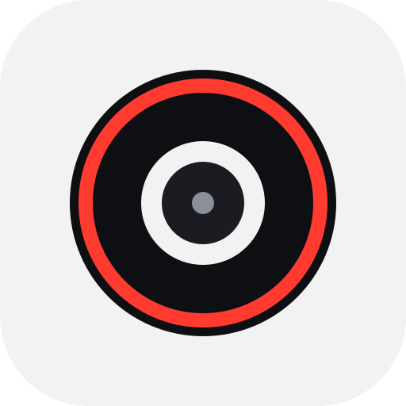
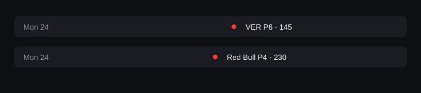

<p align="center">
  
</p>

<h1 align="center">Grid Walk</h1>

<p align="center">
  Race weekend companion for macOS and iPhone.<br/>
  Free, open source, private by default.
</p>

<p align="center">
  
  
  
  
</p>

<p align="center"><strong>App Store subtitle:</strong> Race weekend countdown</p>

<p align="center">
  
</p>

<p align="center">
  
</p>

## What it does

**macOS (menu bar)**
- Countdown to the next session, weekend panel in your local time
- Modes: countdown, my driver, title fight, my team, last race, or auto
- Ticker rotates a few modes; compact style keeps the bar short
- Spoiler-free hides last-race text until you want it
- Pick a favorite driver and team in Settings

**iPhone**
- Big countdown plus the full weekend session list
- Live Activity / Dynamic Island when the next session is within about 6 hours

**Both**
- Local alerts 15 minutes before Qualifying, Sprint, and Race (configurable)
- One tap to add the weekend to Calendar
- Home / desktop widgets with a live countdown

No accounts. No tracking. No backend of our own. Schedule and standings come from the public [Jolpica](https://github.com/jolpica/jolpica-f1) feed (Ergast-compatible) and are cached on device so the countdown keeps working offline.

## Private by default

Everything runs on your Mac or iPhone. Session times and standings live in the App Group cache. Alert and menu bar preferences stay in UserDefaults. Notifications and Calendar access are optional and local only.

## Platforms

| Platform | Minimum | What you get |
| --- | --- | --- |
| macOS | 14+ | Menu bar app + desktop widget |
| iPhone | iOS 17+ | App, home/lock screen widgets, Live Activity |

Liquid Glass / AlarmKit stay optional extras for newer OS versions — the app targets 14 / 17 so it runs on current devices.

Distribution: App Store / TestFlight later. DMG and Homebrew are planned for Mac builds outside the store. The placeholder mark above is temporary until the final app icon ships; real screenshots will replace the mockups.

## Develop

Requirements: Xcode 16+, macOS 14+ / iOS 17+.

```bash
# Package tests (no Xcode UI needed)
cd GridWalkKit && swift test

# App
open "Grid Walk.xcodeproj"
```

Shared logic lives in `GridWalkKit`. App and widget targets stay thin (SwiftUI / WidgetKit). If signing fails, enable App Group `group.com.gabrieldazzi.gridwalk` on the App ID in the Apple Developer portal.

More layout and data notes: [AGENTS.md](AGENTS.md).

## Contributing

See [CONTRIBUTING.md](CONTRIBUTING.md). Translations (English + Portuguese) and accessibility labels are good first PRs.

## Trademark

"Grid Walk" and the app icon are protected — see [TRADEMARKS.md](TRADEMARKS.md). Do not use the name or logo in a way that implies official affiliation with any championship, team, or series.

## Donations

Every feature stays free. Tips help keep the lights on:

- [Ko-fi](https://ko-fi.com/gabrieldazzi)
- [Buy Me a Coffee](https://buymeacoffee.com/gabrieldazzi)

Donation links stay in the README and Mac builds shipped outside the App Store — not in App Store builds.

## License

[MIT](LICENSE)
